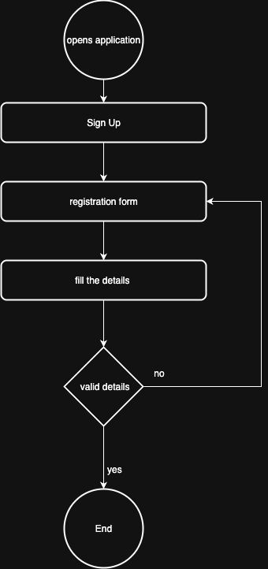
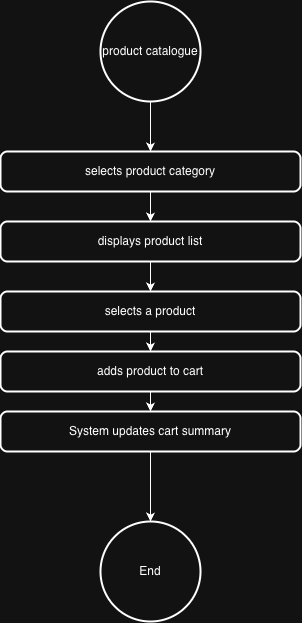
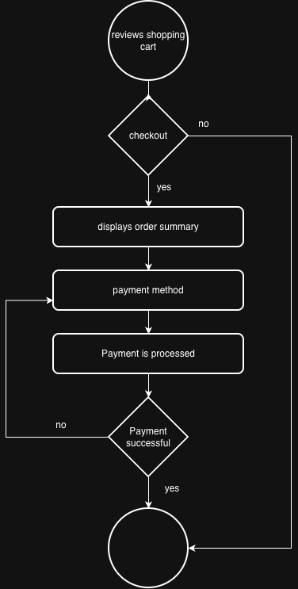

# Business Requirements Document (BRD)

## 1. Document Control
- **Project Name:** Online Shopping Application
- **Document Type:** Business Requirements Document (BRD)
- **Version:** 1.0
- **Prepared By:** Business Analyst
- **Date:**

---

## 2. Purpose
The purpose of this document is to define the business requirements for the development of an online shopping application that enables customers to browse products, manage shopping carts, complete purchases, and receive order notifications.

---

## 3. Business Objectives
- Increase digital sales capability through an online platform
- Improve customer experience and accessibility
- Enable scalable and secure online transactions
- Provide timely communication to customers regarding orders

---

## 4. Stakeholders
- Business Owner
- Sales & Marketing Team
- IT / Development Team
- Customer Support Team
- End Users (Customers)

---

## 5. In-Scope
- User account creation and management
- Product browsing by category
- Shopping cart functionality
- Checkout with multiple payment options
- Automated email notifications for orders

---

## 6. Out-of-Scope
- Inventory management
- Vendor onboarding
- Loyalty or rewards programs
- Mobile native applications (Phase 1)

---

## 7. Business Requirements
- The system must allow customers to create and manage user accounts.
- The system must allow customers to browse products by category.
- The system must support adding, updating, and removing products from a shopping cart.
- The system must provide a secure checkout process with multiple payment options.
- The system must send automated email notifications for order confirmations.

---

## 8. Non-Functional Requirements
### Security
- The system must comply with payment security standards.
- User data must be securely stored and transmitted.

### Performance
- Pages must load within acceptable response times under normal load.

### Availability
- The system must be available 24/7 excluding scheduled maintenance.

---

## 9. Assumptions
- Users have access to the internet and a valid email address.
- Payment gateways and email services are available and reliable.

---

## 10. Dependencies
- Third-party payment gateway services
- Email notification service provider
- Hosting and infrastructure platform

---

## 11. Approval
| Name | Role | Signature | Date |
|-----|------|-----------|------|
|     |      |           |      |

---

## 12. JIRA-Ready User Stories

### Epic 1: User Account Management
- **User Story:** As a customer, I want to create an account so that I can manage my orders and personal details.
  - Priority: High
  - Story Points: 5
  - Acceptance Criteria:
    - User can register with valid details
    - Confirmation is displayed after successful registration

- **User Story:** As a customer, I want to log in securely so that my account information is protected.
  - Priority: High
  - Story Points: 3

### Epic 2: Product Browsing
- **User Story:** As a customer, I want to browse products by category so that I can easily find relevant items.
  - Priority: High
  - Story Points: 5

### Epic 3: Shopping Cart
- **User Story:** As a customer, I want to add products to a shopping cart so that I can review them before checkout.
  - Priority: High
  - Story Points: 5

### Epic 4: Checkout & Payment
- **User Story:** As a customer, I want to checkout using multiple payment options so that I can choose my preferred method.
  - Priority: High
  - Story Points: 8

### Epic 5: Notifications
- **User Story:** As a customer, I want to receive email notifications so that I am informed about my order status.
  - Priority: Medium
  - Story Points: 3

---

## 13. Wireframe-Level Functional Flows (Textual)

### Flow 1: User Registration
1. User selects "Sign Up"
2. System displays registration form
3. User enters details and submits
4. System validates input
5. Account is created and confirmation shown

[User Registration](./image/user-registration.drawio)

### Flow 2: Browse and Add to Cart
1. User selects a product category
2. System displays product list
3. User selects a product
4. User adds product to cart
5. System updates cart summary

[Browse and Add to Cart](./image/browse-and-add-to-cart.drawio)

### Flow 3: Checkout Process
1. User reviews shopping cart
2. User proceeds to checkout
3. System displays order summary
4. User selects payment method
5. Payment is processed
6. Order confirmation is displayed
   

[Checkout Process](./image/image/checkout-process.drawio)

---

## 14. BPMN / UML Mapping (High-Level)

### BPMN Process: Order Placement
- Start Event: User accesses application
- Task: User logs in / registers
- Task: Browse products
- Task: Add items to cart
- Task: Review cart
- Gateway: Proceed to checkout?
- Task: Select payment method
- Task: Process payment
- Gateway: Payment successful?
  - Yes: Confirm order and send email
  - No: Display error and retry payment
- End Event: Order completed

### UML Use Case Overview
- Actors: Customer, Payment Gateway, Email Service
- Use Cases:
  - Register Account
  - Log In
  - Browse Products
  - Manage Cart
  - Checkout Order
  - Receive Notifications

